# Azure Machine Learning Engineer Nanodegree Capstone Project

This project aims to create a web service endpoint for Hyperdrive and AutoML models trained using the Azure ML SDK. The model with best accuracy is then deployed and consumed.

## Dataset

### Overview
The dataset chosen for this project can be found [here](https://www.kaggle.com/uciml/pima-indians-diabetes-database).

It consists of several medical predictors (independent) variables and one target (dependent) variable, Outcome. Independent variables include:
* Pregnancies
* Glucose
* BloodPressure
* SkinThickness
* Insulin
* BMI
* DiabetesPedigreeFunction 
* Age

The dependent variable is 'Outcome' which has "1" for patients who were found to have diabetes, and "0" for those who weren't.

The dataset has 768 entries, with the medical indicators for approximately 35% diabetic and 65% non-diabetic patients. The class imbalance here is negligible.

### Task
The purpose of this project will be to work on an external dataset of choice, in this case, the Pima Indians Diabetes dataset. Using Azure ML SDK, the data will be used to train different HyperDrive and AutoML models. The job is a classification type task, and the model that performs the best in terms of accuracy will be deployed as a web service on Azure. The resulting endpoint will be then be consumed.

In the case of HyperDrive, a Logistic Regression classifier will be utilized.

### Access
For ease of access, the data has been uploaded to this repository itself, and is brought into the Azure environment using the following code:
```python
dataset_url = "https://raw.githubusercontent.com/shubhrasachdev/AzureML-Nanodegree-Capstone/main/diabetes.csv"
ds = TabularDatasetFactory.from_delimited_files(path =dataset_url)
dataset = ds.register(workspace = ws,
                      name = key,
                      description = description_text)
```

The registered dataset in Azure ML Studio - 

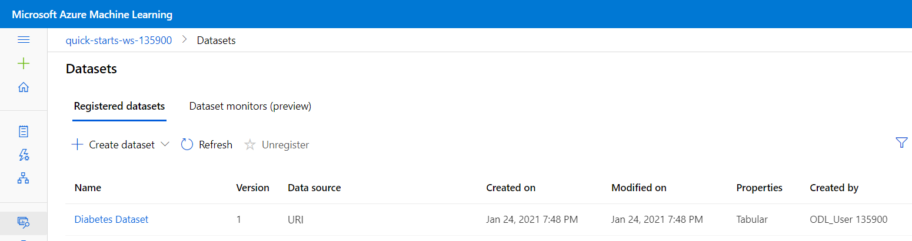

## Automated ML
The settings for the AutoML run are as follows - 
* Experiment Timeout - This is set to a period of 60 minutes, which is sufficient time to get a model with satisfactory accuracy.
* Maximum Concurrent Iterations - The number of runs that can be processed concurrently. This value cannot be greater than the maximum number of nodes in the compute cluster to be utilized.
* Primary Metric - This is set as Accuracy.
* A Computer target is also specified for running the experiment
* Task - This is set as Classification, since we wish to predict whether or not a patient with given medical predictors has diabetes.
* Training Data - Chosen as the Pima Indians Diabetes dataset from Kaggle
* Label Column Name - Specified as "Öutcome", and has binary values (1s or 0s)
* Early Stopping has been enabled to ensure the experiment does not run for a long time.
* Model Explainability is set to true, for the purposes of studying the feature importance.
* Featurization is set to "auto"
* The number of cross validations is set to 5

### Results
Among the many models trained during the AutoML run, the best performing model was the Voting Ensemble Model, which gave an accuracy of 0.78.

Below is a screenshot of the run details widget -

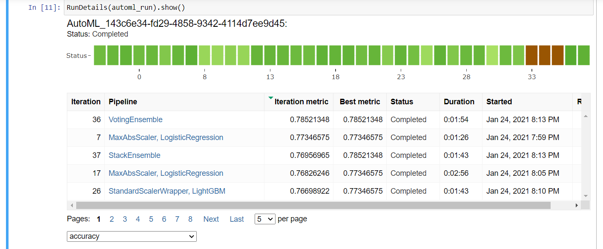

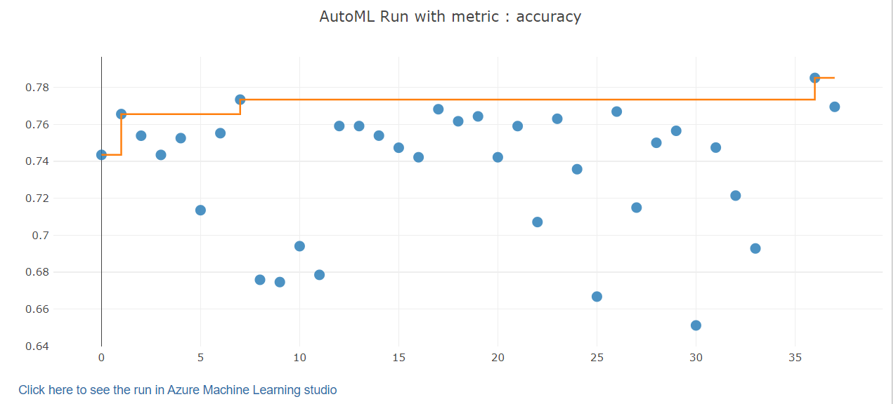

Some models trained by AutoML -

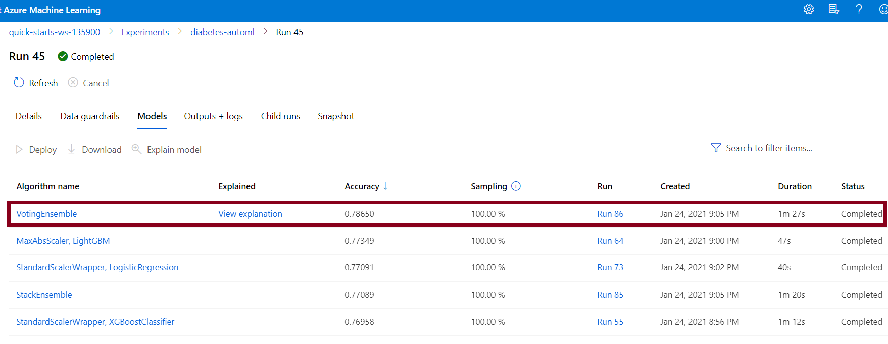

The best AutoML model - 

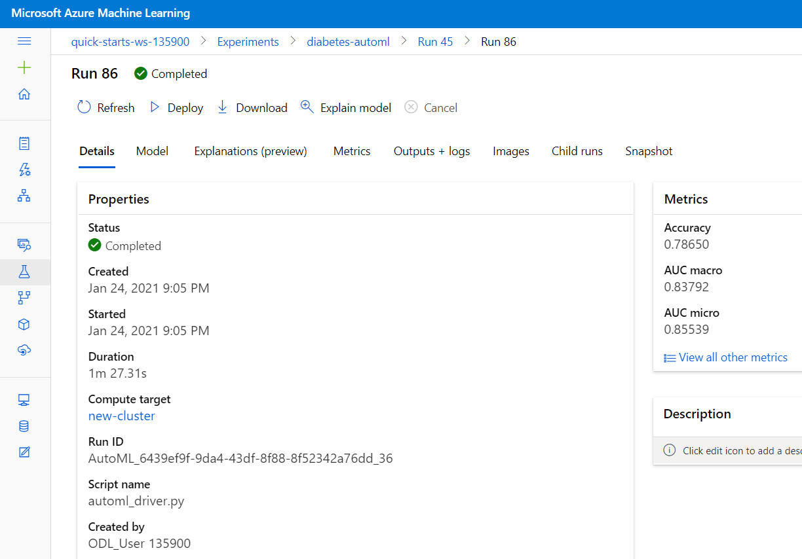

Additionally, the feature importance was also observed by setting model explainability to true while submitting the AutoML run.

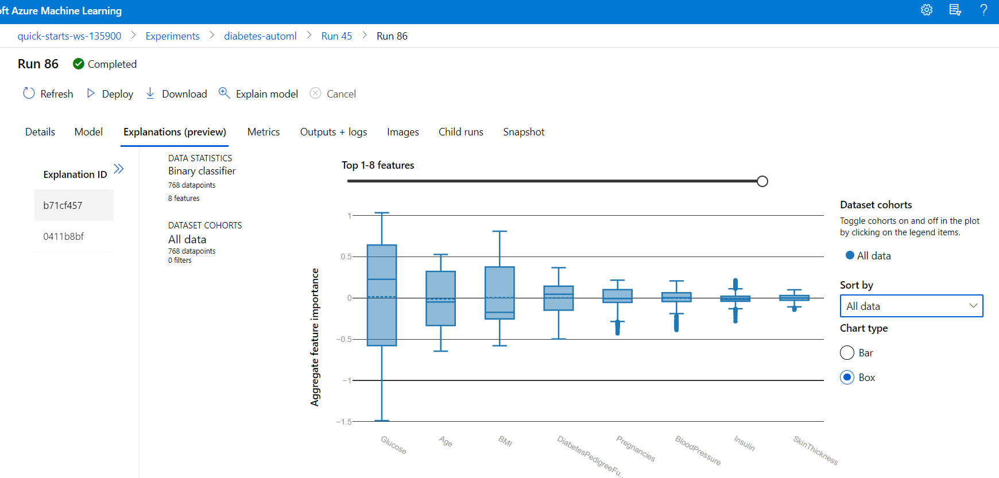

Properties of the best model -

```
datatransformer
{'enable_dnn': None,
 'enable_feature_sweeping': None,
 'feature_sweeping_config': None,
 'feature_sweeping_timeout': None,
 'featurization_config': None,
 'force_text_dnn': None,
 'is_cross_validation': None,
 'is_onnx_compatible': None,
 'logger': None,
 'observer': None,
 'task': None,
 'working_dir': None}

prefittedsoftvotingclassifier
{'estimators': ['15', '24', '6', '16', '11', '2', '29', '7'],
 'weights': [0.1, 0.1, 0.1, 0.1, 0.2, 0.1, 0.1, 0.2]}

15 - maxabsscaler
{'copy': True}

15 - lightgbmclassifier
{'boosting_type': 'goss',
 'class_weight': None,
 'colsample_bytree': 0.7922222222222222,
 'importance_type': 'split',
 'learning_rate': 0.06316157894736842,
 'max_bin': 250,
 'max_depth': 7,
 'min_child_samples': 69,
 'min_child_weight': 1,
 'min_split_gain': 0.8421052631578947,
 'n_estimators': 400,
 'n_jobs': 1,
 'num_leaves': 149,
 'objective': None,
 'random_state': None,
 'reg_alpha': 0.15789473684210525,
 'reg_lambda': 0.7894736842105263,
 'silent': True,
 'subsample': 1,
 'subsample_for_bin': 200000,
 'subsample_freq': 0,
 'verbose': -10}

24 - standardscalerwrapper
{'class_name': 'StandardScaler',
 'copy': True,
 'module_name': 'sklearn.preprocessing._data',
 'with_mean': False,
 'with_std': False}

24 - logisticregression
{'C': 5.428675439323859,
 'class_weight': None,
 'dual': False,
 'fit_intercept': True,
 'intercept_scaling': 1,
 'l1_ratio': None,
 'max_iter': 100,
 'multi_class': 'multinomial',
 'n_jobs': 1,
 'penalty': 'l2',
 'random_state': None,
 'solver': 'lbfgs',
 'tol': 0.0001,
 'verbose': 0,
 'warm_start': False}

6 - standardscalerwrapper
{'class_name': 'StandardScaler',
 'copy': True,
 'module_name': 'sklearn.preprocessing._data',
 'with_mean': False,
 'with_std': False}

6 - xgboostclassifier
{'base_score': 0.5,
 'booster': 'gbtree',
 'colsample_bylevel': 1,
 'colsample_bynode': 1,
 'colsample_bytree': 0.5,
 'eta': 0.3,
 'gamma': 0,
 'learning_rate': 0.1,
 'max_delta_step': 0,
 'max_depth': 4,
 'max_leaves': 0,
 'min_child_weight': 1,
 'missing': nan,
 'n_estimators': 100,
 'n_jobs': 1,
 'nthread': None,
 'objective': 'reg:logistic',
 'random_state': 0,
 'reg_alpha': 2.3958333333333335,
 'reg_lambda': 1.7708333333333335,
 'scale_pos_weight': 1,
 'seed': None,
 'silent': None,
 'subsample': 0.7,
 'tree_method': 'auto',
 'verbose': -10,
 'verbosity': 0}

16 - maxabsscaler
{'copy': True}

16 - logisticregression
{'C': 2.559547922699533,
 'class_weight': None,
 'dual': False,
 'fit_intercept': True,
 'intercept_scaling': 1,
 'l1_ratio': None,
 'max_iter': 100,
 'multi_class': 'ovr',
 'n_jobs': 1,
 'penalty': 'l2',
 'random_state': None,
 'solver': 'saga',
 'tol': 0.0001,
 'verbose': 0,
 'warm_start': False}

11 - standardscalerwrapper
{'class_name': 'StandardScaler',
 'copy': True,
 'module_name': 'sklearn.preprocessing._data',
 'with_mean': False,
 'with_std': True}

11 - randomforestclassifier
{'bootstrap': False,
 'ccp_alpha': 0.0,
 'class_weight': None,
 'criterion': 'entropy',
 'max_depth': None,
 'max_features': 0.2,
 'max_leaf_nodes': None,
 'max_samples': None,
 'min_impurity_decrease': 0.0,
 'min_impurity_split': None,
 'min_samples_leaf': 0.01,
 'min_samples_split': 0.10368421052631578,
 'min_weight_fraction_leaf': 0.0,
 'n_estimators': 25,
 'n_jobs': 1,
 'oob_score': False,
 'random_state': None,
 'verbose': 0,
 'warm_start': False}

2 - maxabsscaler
{'copy': True}

2 - randomforestclassifier
{'bootstrap': False,
 'ccp_alpha': 0.0,
 'class_weight': None,
 'criterion': 'gini',
 'max_depth': None,
 'max_features': 'sqrt',
 'max_leaf_nodes': None,
 'max_samples': None,
 'min_impurity_decrease': 0.0,
 'min_impurity_split': None,
 'min_samples_leaf': 0.01,
 'min_samples_split': 0.10368421052631578,
 'min_weight_fraction_leaf': 0.0,
 'n_estimators': 10,
 'n_jobs': 1,
 'oob_score': False,
 'random_state': None,
 'verbose': 0,
 'warm_start': False}

29 - standardscalerwrapper
{'class_name': 'StandardScaler',
 'copy': True,
 'module_name': 'sklearn.preprocessing._data',
 'with_mean': False,
 'with_std': True}

29 - randomforestclassifier
{'bootstrap': True,
 'ccp_alpha': 0.0,
 'class_weight': 'balanced',
 'criterion': 'gini',
 'max_depth': None,
 'max_features': 0.2,
 'max_leaf_nodes': None,
 'max_samples': None,
 'min_impurity_decrease': 0.0,
 'min_impurity_split': None,
 'min_samples_leaf': 0.08736842105263157,
 'min_samples_split': 0.01,
 'min_weight_fraction_leaf': 0.0,
 'n_estimators': 100,
 'n_jobs': 1,
 'oob_score': True,
 'random_state': None,
 'verbose': 0,
 'warm_start': False}

7 - sparsenormalizer
{'copy': True, 'norm': 'l2'}

7 - xgboostclassifier
{'base_score': 0.5,
 'booster': 'gbtree',
 'colsample_bylevel': 1,
 'colsample_bynode': 1,
 'colsample_bytree': 0.9,
 'eta': 0.3,
 'gamma': 0,
 'learning_rate': 0.1,
 'max_delta_step': 0,
 'max_depth': 9,
 'max_leaves': 0,
 'min_child_weight': 1,
 'missing': nan,
 'n_estimators': 25,
 'n_jobs': 1,
 'nthread': None,
 'objective': 'reg:logistic',
 'random_state': 0,
 'reg_alpha': 0,
 'reg_lambda': 0.7291666666666667,
 'scale_pos_weight': 1,
 'seed': None,
 'silent': None,
 'subsample': 0.9,
 'tree_method': 'auto',
 'verbose': -10,
 'verbosity': 0}
```

### Future Improvements
* Utilization of deep learning algorithms to achieve better performance - Deep learning algorithms should be tried for optimizing the resolution of this problem, as they often give better results than traditional machine learning algorithms.
* Increasing experiment timeout - This may allow more iterations of the AutoML experiment to run and optimize the accuracy even further
* Eliminating models with poor performance from list of algorithms to be used - This will allow more time for models giving a good performance to be optimized more
* Utilizing a metric other than Accuracy to measure performance - Sometimes, accuracy is not the best metric to base the performance of a model on. More robust metrics like AUC_Weighted may also be considered.

## Hyperparameter Tuning
The model being used for the Hyperdrive run is a Logistic Regression model from the SKLearn framework that will help predict if a patient is likely to suffer from diabetes. The hyperparameters chosen to be fine tuned are:
* Inverse of Regularization Strength "C" - This parameter was randomly sampled from a set of values (0.01, 0.1, 1, 10, 100, 1000). The C parameter controls the penalty strength, which can be effective for preventing overfitting and ensure a better generalized performance of the model.
* Maximum Iterations "max_iter"- This parameter was randomly sampled from a set of values (25, 50, 100, 150, 250). It is the Maximum number of iterations taken to converge.

In this experiment, we find that different combinations of values from the above stated parameters present us with varying levels of accuracy.

The Hyperdrive run also involves other configuration settings like an early termination policy (Bandit), a compute target to run the experiment, a primary metric for evaluation (Accuracy in this case), and maximum number of runs (20).


### Results
The best model during the HyperDrive Run was a Logistic regression model with C = 100 and max_iter = 100. The accuracy of this model is 0.82.

Below is a screenshot of the run details widget -

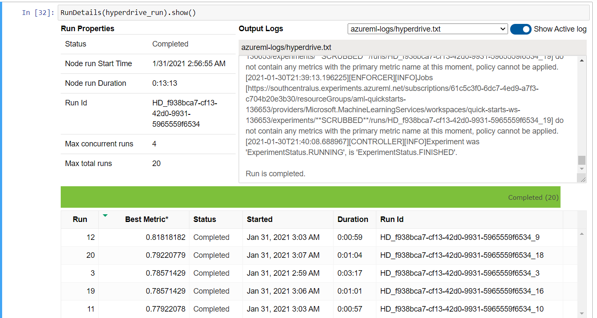

Visual Representations of the HyperDrive Run - 

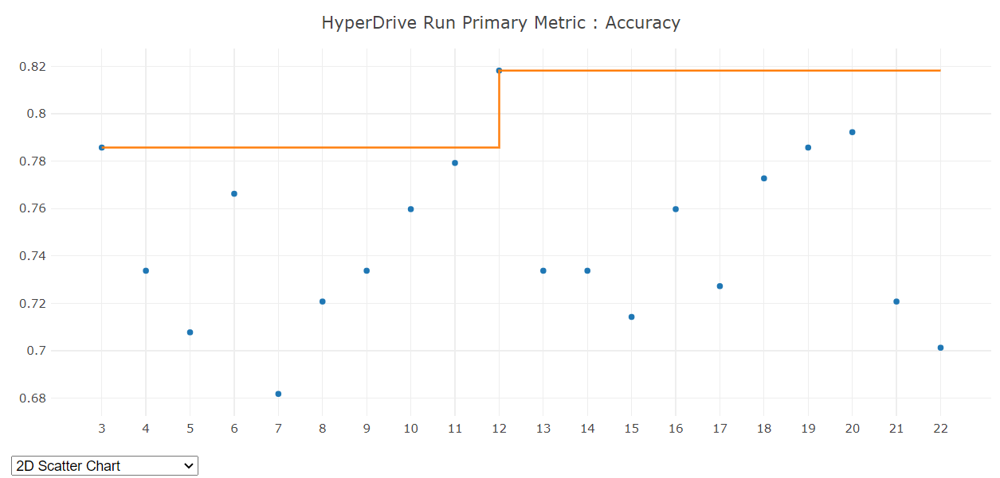

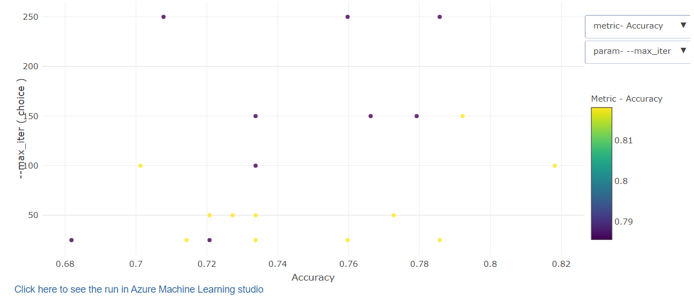

Models generated during HyperDrive run -

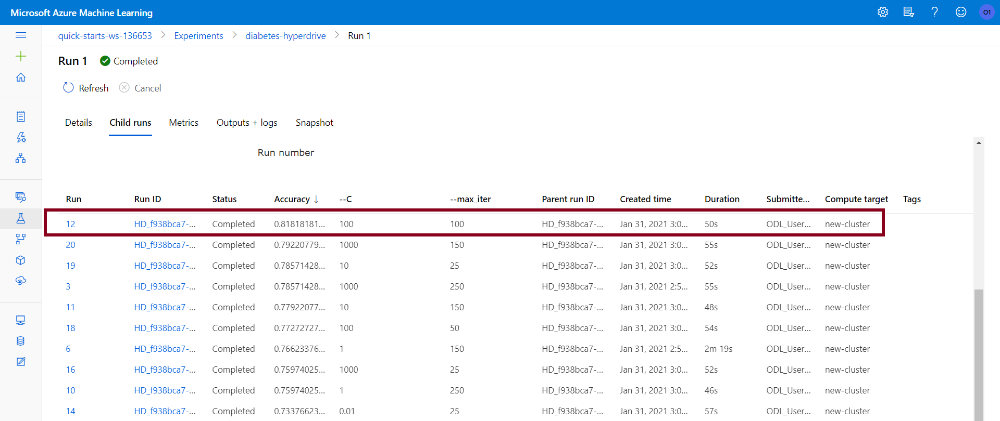

The best HyperDrive model -

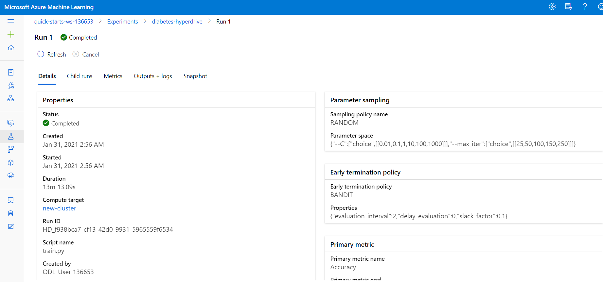


### Future Improvements
* Implementing other classifiers like SVM, Random Forest - The current project has only been run using the Logistic Regression classifier. It is entirely possible that other classifiers may offer better performance than the one used.
* Using a more finely tuned sampler for 'C' in HyperDrive - Currently, the regularization strength parameter has been randomly sampled. The performance of the Hyperdrive model may improve if the sampling range would be further narrowed down closer to the best hyperparameter value that is known from prior runs. 
* Increasing maximum total runs - More runs may allow new combinations of hyperparameters to be used, and give better performance.
* Modifying primary metric from Accuracy to something else, like AUC Weighted - Sometimes, accuracy is not the best metric to base the performance of a model on. More robust metrics like AUC_Weighted may also be considered.


## Model Deployment
AutoMl run produces a best model with an accuracy of 0.78, which is lower than the accuracy of the best model as produced by the HyperDrive run, which is 0.82.

Hence, the best model from the HyperDrive run is registered in the workspace.

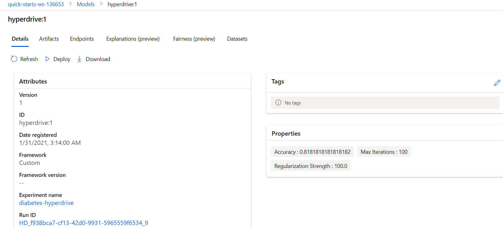

The registered model is then deployed in an endpoint that can be accessed using the a REST API that looks something like this:

 http://XXXXXXXX-XXXX-XXXX-XXXX-XXXXXXXXXXXX.southcentralus.azurecontainer.io/score

The deployed service can be now observed in the workspace under endpoints, with a 'Healthy' status - 

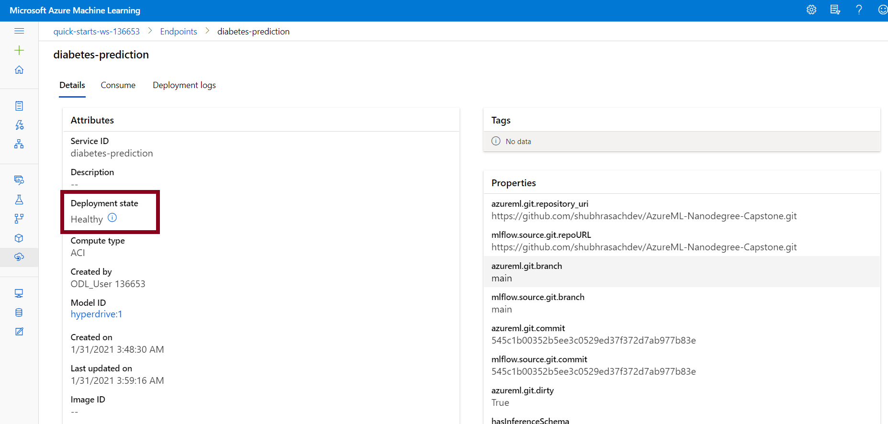


The input to be provided to the above endpoint should be in the JSON format. For Eg. - 
```
"data":
        [
            {
                "Pregnancies": 6,
                "Glucose": 148,
                "BloodPressure": 72,
                "SkinThickness": 35,
                "Insulin": 0,
                "BMI": 33.6,
                "DiabetesPedigreeFunction": 0.627,
                "Age": 50
            }
        ]
```

To query the endpoint using above data - 
```python
import requests
import json

scoring_uri = 'http://01b44a8b-d762-47c0-af37-16bc6cdf52aa.southcentralus.azurecontainer.io/score'

data = { "data":
        [
            {
                "Pregnancies": 6,
                "Glucose": 148,
                "BloodPressure": 72,
                "SkinThickness": 35,
                "Insulin": 0,
                "BMI": 33.6,
                "DiabetesPedigreeFunction": 0.627,
                "Age": 50
            }
        ]
       }

input_payload = json.dumps(data)
headers = {'Content-Type': 'application/json'}
response = requests.post(scoring_uri, input_payload, headers=headers)
print(response.json())
```

As a response, we receive either a 1 or a 0, representing the predictions that the person is diabetic or not respectively.

## Screen Recording
https://youtu.be/BlVoA5Lf6HM

## Standout Suggestions
In addition to the project requirements, some additional features from standout suggestions were also implemented.

1. Enabling logging for the deployed webservice: This was done using the following code snippet -
```
service.update(enable_app_insights=True)
```

This can then be confirmed by viewing the settings of the deployed endpoint from Azure Machine Learning Studio.

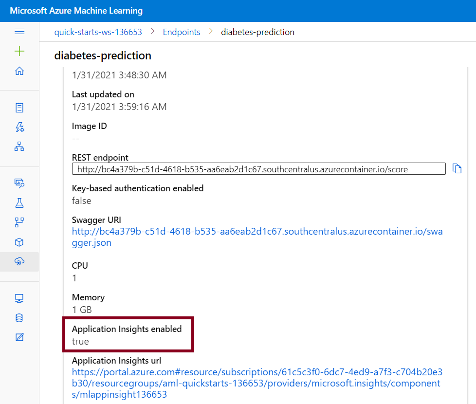


2. Exporting the model to ONNX format: This was done using the following code snippet -
```
from skl2onnx import convert_sklearn
import onnxmltools
from onnxmltools import convert_sklearn
from onnxmltools.utils import save_model
from onnxmltools.convert.common.data_types import *
lr_model = joblib.load('model.joblib')
initial_type = [('float_input', FloatTensorType([1, 4]))]
onnx_model = onnxmltools.convert_sklearn(lr_model,initial_types=initial_type)
save_model(onnx_model, "model.onnx")
```

As a result, a model.onnx file is generated.

